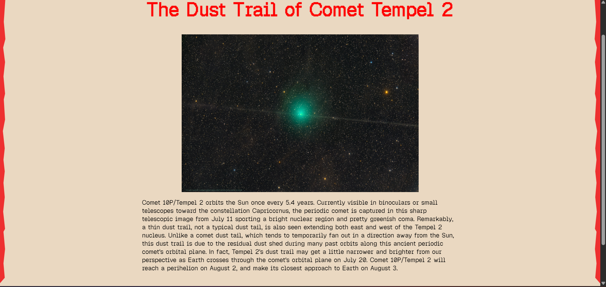

# Nasa astronomy!!

A minimal and basic website that uses the data from the NASA's astronomy picture of the day api and displays it in a github hosted website [Github Pages]  
  

## Description
This website uses the data provided by the nasa's picture of the day api and displays it on a website. .gitignore, git secret in the repo and keeps the api key secure.

## Features

- fast and responsive
- shows and describes a new picture everyday and its description 
- keeps the api key secure.

## Languages
- HTML
- CSS
- JavaScipt

## Browsers
- all browsers [chrome, firefox, brave, edge etc]

## APIs used
- APOD from NASA
- google fonts api

## Guides followed
- this wonderful guide made by @Alisha for Hack Club stardance https://stardance.hackclub.com/missions/nasa-page
